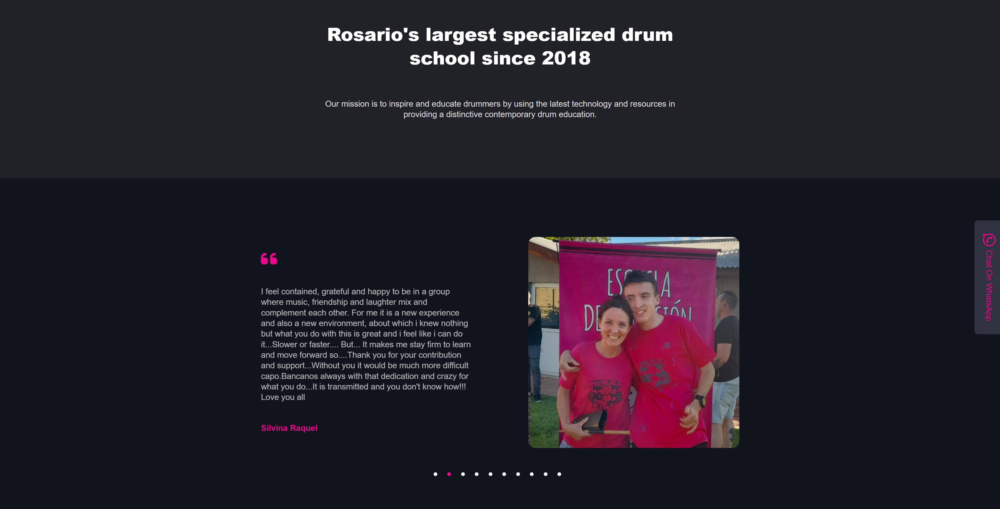
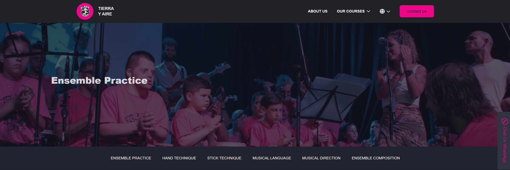
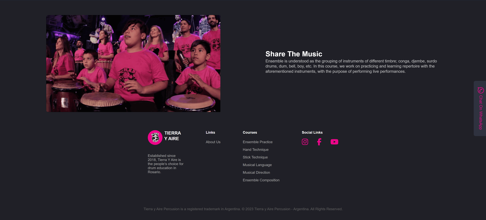
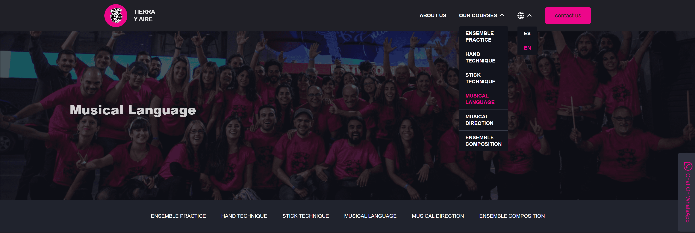

# Tierra y Aire Percusion

Website for the "Tierra y Aire Percusion" music school in Argentina.

## 🛠️ Technologies Stack

- **Frontend**: React / JavaScript / SASS
- **Backend**: WIP under https://github.com/amafigu/percussion-music-school-backend
- **Database**: Postgres
- **Tests**: Jest / React Testing Library

## 🌟 Functionalities

### Translation

The application supports multiple languages, currently including:

- Spanish
- English

### Responsive Design

The application is designed to be fully responsive and works seamlessly across various devices and screen sizes.

## 📸 Screenshots

### Homepage Top


### Homepage Button



### Course pages Top



### Course pages Bottom



### Navigation Menu



## 📦 Setup and Installation

1. Clone the repository:
   ```sh
   git clone https://github.com/amafigu/percussion-music-school.git
   ```
2. Navigate to the project directory:

```sh
  cd recipe-portfolio-app
```

3. Install frontend dependencies:

```sh
cd frontend
npm install
```
